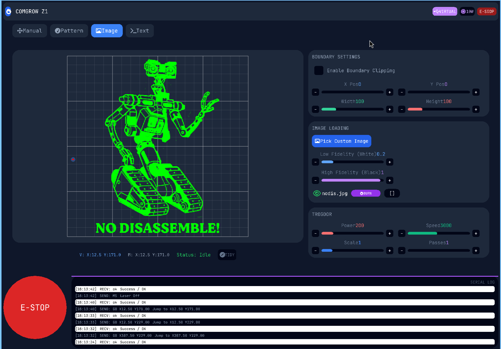
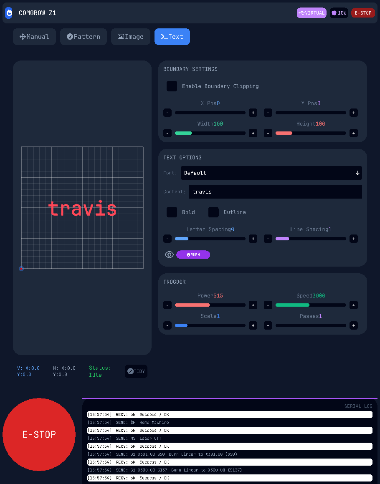

# Comgrow Z1 Laser GRBL Runner




A custom engineering tool for the Comgrow Z1 Laser engraver, featuring a high-fidelity tabbed UI and a safety-first CLI.

## New Features
- **Interactive Text Tab**: 
    - Type directly into the UI with a blinking cursor.
    - Select from all available system fonts with a scrollable dropdown.
    - High-fidelity vector and raster rendering via `font-kit`.
- **Content-Aware Outline Tracing**:
    - Use the `[]` button to trace the exact footprint of your work without firing the laser.
    - Traces text, images, and patterns with precision.
- **Optimized Bidirectional Scanning**:
    - Efficient zigzag raster paths for text and images.
    - Drastically reduced travel time between lines.
- **Automatic Homing**: Every job automatically begins and ends with a `$H` sequence for perfect calibration.

## Core Features
- **Tabbed Interface**: 
    - **Manual**: Full 3-column layout with 40+ Quick Commands and Jog controls.
    - **Text**: Advanced text rendering and engraving controls.
    - **Image**: Custom image loading with fidelity and scale adjustment.
    - **Pattern**: Direct access to built-in burn patterns and SVG loading.
- **Docked Engineering Console**: Persistent Serial Log and massive E-STOP button fixed to the bottom of the screen.
- **Virtual Grid**: Real-time persistent visualizer showing machine and virtual head positions.
- **UI Scaling**: Full interface zooming via `Ctrl` + `+/-` that respects layout boundaries.
- **Safety**: Robust `SafetyGuard` ensures the laser is powered down and machine reset on any exit or crash.

## Setup

### 1. Install Dependencies
Run the included installation script to set up required system libraries:
```bash
./install-dependent-packages.sh
```

### 2. Build
Use the build script which handles the local `libudev` workaround:
```bash
./build.sh
```

### 3. Permissions
Ensure you have access to the serial port:
```bash
sudo chmod 666 /dev/ttyUSB0
```

## Usage

### GUI Mode
Run without arguments to launch the graphical interface:
```bash
./target/debug/comgrow-z1-app
```

### CLI Mode (Command Labels)
Run any command defined in the UI by its label:
```bash
./target/debug/comgrow-z1-app Status
./target/debug/comgrow-z1-app Unlock
./target/debug/comgrow-z1-app Home
```

### CLI Mode (Raw G-Code)
Send raw G-Code directly to the machine:
```bash
./target/debug/comgrow-z1-app "G91 G0 X20 Y20"
```

### Test Patterns (CLI)
Execute predefined shapes or assets using named parameters:
```bash
./target/debug/comgrow-z1-app test-pattern [shape] --power [pct]% --speed [pct]% --scale [scale]x --passes [count]
```

## Safety
- **Soft Reset**: Always available in the UI or via `Reset` in CLI.
- **E-STOP on Exit**: Automatically sends `!`, `M5`, `0x18` on normal exit or `Ctrl-C`.
- **Dynamic Visual Feedback**: E-STOP buttons turn green when the machine is in an Alarm or Hold state.
- **Dynamic Power**: Uses `M4` mode to prevent over-burn during speed changes.
